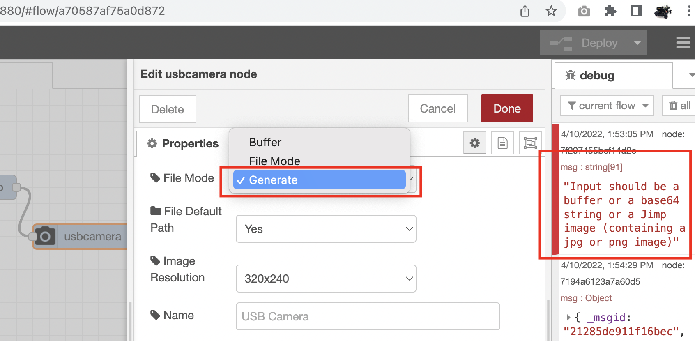

### setup raspbrry pi using 
https://github.com/lbaitemple/raspberry_IP/tree/nomqtt

# install node-red 


(https://nodered.org/docs/getting-started/raspberrypi)
```
sudo apt update && sudo apt upgrade -y
sudo apt install build-essential git curl -y
bash <(curl -sL https://raw.githubusercontent.com/node-red/linux-installers/master/deb/update-nodejs-and-nodered)
sudo systemctl enable nodered.service
sudo systemctl start nodered.service
```
### enable usb camera
```
sudo usermod -a -G video $USER

```
### install tensorflow
```
sudo apt install fswebcam -y
cd ~/.node-red
npm install @tensorflow/tfjs 
```

#### In pallet install
```
node-red-contrib-usbcamera 
node-red-contrib-camerapi
node-red-dashboard
node-red-node-base64
node-red-contrib-image-output
node-red-contrib-teachable-machine
```

For raspberry pi camera, you will need to run
```
sudo apt-get install python-picamera python3-picamera -y
```

### install neopixel
```
curl https://get.pimoroni.com/unicornhat | bash
cd ~/.node-red
npm install node-red-node-pi-neopixel
```
#### choose USB_camera

You will need to choose generate before use buffer option

### use webstream
```
git clone https://github.com/jacksonliam/mjpg-streamer
cd ./mjpg-streamer/mjpg-streamer-experimental
sudo ./mjpg_streamer -i "./input_uvc.so -f 10 -r 148x102 -n -y" -o "./output_http.so -w ./www -p 8080"
cat bashrc >> ~/.bashrc
source ~/.bashrc
cam
```
###### check the steam using http://ipaddress:8080/stream.html

#### Yolo
```
cd ~
git clone https://github.com/tmobile/node-red-contrib-yolo-object-detection
cd ~/.node-red
npm i node-red-contrib-yolo-object-detection
```
#### may needed.....

## install dependencies
```
cd ~
git clone https://github.com/IBM/node-red-tensorflowjs
cd ~/node-red-tensorflowjs
npm install
cd ~/.node-red
npm install ~/node-red-tensorflowjs/node-red-contrib-tfjs-object-detection/node-red-contrib-tfjs-object-detection
```


